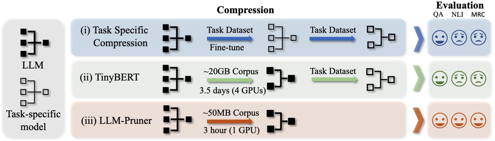
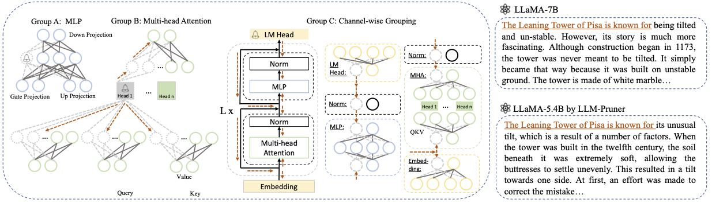
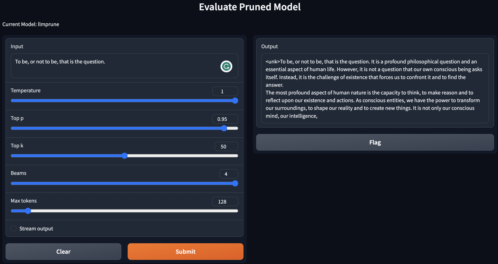
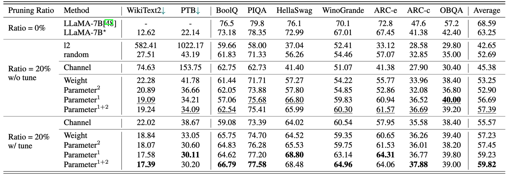
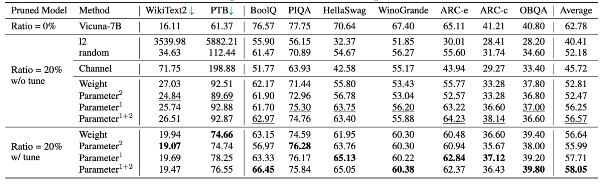
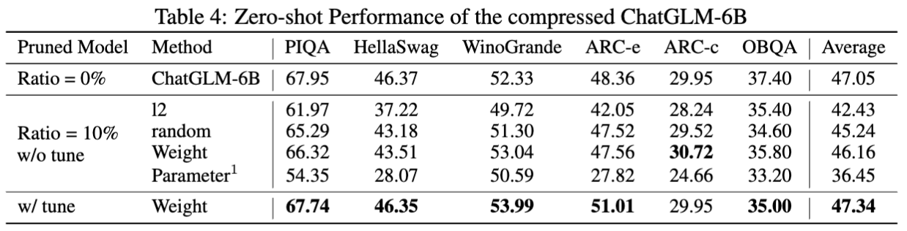
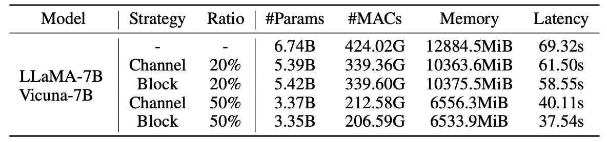

<p align="center">
 <br>
</p>

<div align="center">
<h1>LLM-Pruner</h1>
  <div align="center">
  <a href="https://opensource.org/licenses/Apache-2.0">
    
  </a>
  <a href="https://pytorch.org/">
    =v1.7.1">
  </a>
  <a href="https://github.com/facebookresearch/llama">
    
  </a>
  <a href="https://github.com/facebookresearch/llama">
    
  </a>
  <a href="https://github.com/lm-sys/FastChat">
    
  </a>
  <a href="https://huggingface.co/docs/transformers/model_doc/bloom">
    
  </a>
  <a href="https://github.com/THUDM/ChatGLM-6B">
    
  </a>
    <a href="https://github.com/baichuan-inc/Baichuan-7B">
    
  </a>
</div>
<h3>On the Structural Pruning of Large Language Models<h3>
:llama: :llama: :llama: :llama: :llama: Compress your LLMs to any size! :llama: :llama: :llama: :llama: :llama:
</div>

<p align="center">
    
 <br>
</p>


## Introduction
  
> **[LLM-Pruner: On the Structural Pruning of Large Language Models](https://arxiv.org/abs/2305.11627)** [[arXiv]](https://arxiv.org/abs/2305.11627)   
> *Xinyin Ma, Gongfan Fang, Xinchao Wang*   
> *National University of Singapore*  

#### Why LLM-Pruner
- [x] **Task-agnostic compression**: The compressed LLM should retain its original ability as a multi-task solver. 
- [x] **Less training corpus**: In this work, we use only 50k publicly available samples (alpaca) to post-train the LLM.  
- [x] **Efficient compression**: 3 minutes for pruning and 3 hours for post-training. (You can make it longer)
- [x] **Automatic structural pruning**: Pruning new LLMs with minimal human effort (In progress).

#### Supported LLMs:
- [x] [Llama-2 Hugging Face](https://github.com/horseee/LLM-Pruner#1-pruning-discovery-stage--estimation-stage)
- [x] [LLaMA Hugging Face](https://github.com/horseee/LLM-Pruner#1-pruning-discovery-stage--estimation-stage)
- [x] [BLOOM](https://github.com/horseee/LLM-Pruner/tree/main/examples#cherry_blossom-bloom) 
- [x] [Vicuna](https://github.com/horseee/LLM-Pruner#llama-vicuna-pruning)
- [x] [Baichuan](https://github.com/horseee/LLM-Pruner/tree/main/examples#llama-baichuan-pruning)

#### Updates:
* August 30, 2023: LLM-Pruner now supports [BLOOM](https://huggingface.co/docs/transformers/model_doc/bloom) :cherry_blossom:
* August 14, 2023:  [Code](https://github.com/horseee/LLM-Pruner#2-post-training-recover-stage) and [results](https://github.com/horseee/LLM-Pruner#2-post-training-recover-stage) for finetuning with a large-scale corpus are now available. The fine-tuned LLaMA-5.4B model achieves an average accuracy of 62.36%, closely approaching the original LLaMA-7B (63.25%).
* July 19, 2023: :fire:  LLM-Pruner now supports Llama-2-7b and Llama-2-13b (the huggingface version) 
* July 18, 2023: :rocket: Support [Baichuan](https://github.com/baichuan-inc/Baichuan-7B), a bilingual LLM.
* May 20, 2023: :tada: Code and Preprint Paper released! 

#### TODO List:
- [ ] Code for [ChatGLM](https://github.com/THUDM/ChatGLM-6B)
- [ ] A tutorial for pruning new LLMs.
- [ ] Support `.from_pretrained()` for loading the model.

#### Contact Us:

Join our Discord or WeChat group for a chat:
  * Discord: [link](https://discord.gg/Z6r34MnE)
  * WeChat Group [Group 1 (497/500, FULL)](https://github.com/VainF/Torch-Pruning/assets/18592211/35d66130-eb03-4dcb-ad75-8df784460ad3), [Group-2](https://github.com/VainF/Torch-Pruning/assets/18592211/353b6059-3515-49f1-ad45-e44cbdc52415)

## Table of Contents
  - [Quick Start](#quick-start)
  - [Step-by-step Instructions](#step-by-step-instructions)
  - [Zero-shot Evaluation](#zero-shot-evaluation)
  - [More-Examples](#more-examples)
  - [Version Information](#version-information)
  - [Limitations](#limitations)
  - [Acknowledgement](#acknowledgement)
  - [Citation](#citation)

## Quick Start

### Installation
```
pip install -r requirement.txt
```

### Minimal Example
```
bash script/llama_prune.sh
```
This script would compress the LLaMA-7B model with ～20\% parameters pruned. All the pre-trained models and the dataset would be automatically downloaded, so you do not need to manually download the resource. When running this script for the first time, it will require some time to download the model and the dataset.

    
## Step-by-step Instructions  
    
It takes three steps to prune an LLM:
* <u>Discovery Stage</u>: Discover the complicated inter-dependency in LLMs and find the minimally-removable unit, **group**.
* <u>Estimation Stage</u>: Estimate the contribution of each group to the overall performance of the model and decide which group to prune. 
* <u>Recover Stage</u>: Fast post-training to recover model performance.
  
After pruning and post-training, we follow <a href="https://github.com/EleutherAI/lm-evaluation-harness">lm-evaluation-harness</a> for evaluation.
    
### 1. Pruning (Discovery Stage + Estimation Stage)
    
:llama: **LLaMA/Llama-2 pruning with ~20% parameters pruned:**
```
python hf_prune.py --pruning_ratio 0.25 \
      --block_wise \
      --block_mlp_layer_start 4 --block_mlp_layer_end 30 \
      --block_attention_layer_start 4 --block_attention_layer_end 30 \
      --pruner_type taylor \
      --test_after_train \
      --device cpu  --eval_device cuda \
      --save_ckpt_log_name llama_prune 
```
Arguments:
- ``Base model``: Choose the base model from LLaMA or Llama-2 and pass the `pretrained_model_name_or_path` to `--base_model`. The model name is used for `AutoModel.from_pretrained` to load the pre-trained LLM. For example, if you want to use the llama-2 with 13 billion parameters, than pass `meta-llama/Llama-2-13b-hf` to `--base_model`.
- ``Pruning Strategy``: Choose between block-wise, channel-wise, or layer-wise pruning using the respective command options: {--block_wise}, {--channel_wise}, {--layer_wise --layer NUMBER_OF_LAYERS}. For block-wise pruning, specify the start and end layers to be pruned. Channel-wise pruning does not require extra arguments. For layer pruning, use --layer NUMBER_OF_LAYERS to specify the desired number of layers to be kept after pruning.
- ``Importance Criterion``: Select from l1, l2, random, or taylor using the --pruner_type argument. For the taylor pruner, choose one of the following options: vectorize, param_second, param_first, param_mix. By default, param_mix is used, which combines approximated second-order hessian and first-order gradient. If using l1, l2, or random, no extra arguments are required.
- ``Pruning Ratio``: Specifies the pruning ratio of groups. It differs from the pruning rate of parameters, as groups are removed as the minimal units.
- ``Device`` and ``Eval_device``: Pruning and evaluation can be performed on different devices. Taylor-based methods require backward computation during pruning, which may require significant GPU RAM. Our implementation uses the CPU for importance estimation (also support GPU, simply use --device cuda). eval_device is used to test the pruned model.
 


#### :llama: Vicuna Pruning
If you want to try Vicuna, please specify the argument `--base_model` to the path to vicuna weight. Please follow <a href="https://github.com/lm-sys/FastChat">https://github.com/lm-sys/FastChat</a> to get Vicuna weights.
```
python hf_prune.py --pruning_ratio 0.25 \
      --block_wise \
      --block_mlp_layer_start 4 --block_mlp_layer_end 30 \
      --block_attention_layer_start 4 --block_attention_layer_end 30 \
      --pruner_type taylor \
      --test_after_train \
      --device cpu  --eval_device cuda \
      --save_ckpt_log_name llama_prune \
      --base_model PATH_TO_VICUNA_WEIGHTS
```


#### :llama: Baichuan Pruning

Please refer to the [Example/Baichuan](https://github.com/horseee/LLM-Pruner/tree/main/examples#llama-baichuan-pruning) for more details


#### :llama: ChatGLM Pruning
Comming Soon...
    
### 2. Post-Training (Recover Stage)

* Train using Alpaca with 50,000 samples. Here's an example of training on a single GPU:
```
CUDA_VISIBLE_DEVICES=X python post_training.py --prune_model prune_log/PATH_TO_PRUNE_MODEL/pytorch_model.bin \
      --data_path yahma/alpaca-cleaned \
      --lora_r 8 \
      --num_epochs 2 \ 
      --learning_rate 1e-4 \ 
      --batch_size 64 \
      --output_dir tune_log/PATH_TO_SAVE_TUNE_MODEL \ 
      --wandb_project llama_tune
```
Make sure to replace `PATH_TO_PRUNE_MODEL` with the path to the pruned model in step 1, and replace `PATH_TO_SAVE_TUNE_MODEL` with the desired location where you want to save the tuned model.

**Tip**: [Training LLaMA-2 in float16 is not recommended and is known to produce nan; as such, the model should be trained in bfloat16.](https://huggingface.co/docs/transformers/model_doc/llama2#usage-tips)

* Train using [MBZUAI/LaMini-instruction](https://huggingface.co/datasets/MBZUAI/LaMini-instruction) with 2.59M samples. Here is an example using multiple gpus for training:
```
deepspeed --include=localhost:1,2,3,4 post_training.py \
      --prune_model prune_log/PATH_TO_PRUNE_MODEL/pytorch_model.bin \
      --data_path MBZUAI/LaMini-instruction  \
      --lora_r 8 \
      --num_epochs 3  \
      --output_dir tune_log/PATH_TO_SAVE_TUNE_MODEL \
      --extra_val_dataset wikitext2,ptb \
      --wandb_project llmpruner_lamini_tune \
      --learning_rate 5e-5 \
      --cache_dataset
```

### 3. Generation

#### How to load pruned/pre-trained models:

For the pruned model, simply use the following command to load your model. 
``` 
  pruned_dict = torch.load(YOUR_CHECKPOINT_PATH, map_location='cpu')
  tokenizer, model = pruned_dict['tokenizer'], pruned_dict['model']
```
Due to the different configurations between modules in the pruned model, where certain layers may have larger width while others have undergone more pruning, it becomes impractical to load the model using the `.from_pretrained()` as provided by Hugging Face. Currently, we employ the `torch.save` to store the pruned model.
  
Since the pruned model has different configuration in each layer, like some layers might be wider but some layers have been pruned more, the model cannot be loaded with the `.from_pretrained()` in Hugging Face. Currently, we simply use the `torch.save` to save the pruned model and `torch.load` to load the pruned model.
  
#### Generation with Gradio Interface
We provide a simple script to geneate texts using pre-trained / pruned models / pruned models with post-training. 
    
* LLaMA-7B Pre-trained
```
python generate.py --model_type pretrain
```
* Pruned Model without Post-Training
```
python generate.py --model_type pruneLLM --ckpt <YOUR_MODEL_PATH_FOR_PRUNE_MODEL>
```
* Pruned Model with Post-Training 
```
python generate.py --model_type tune_prune_LLM --ckpt <YOUR_CKPT_PATH_FOR_PRUNE_MODEL> --lora_ckpt <YOUR_CKPT_PATH_FOR_LORA_WEIGHT>
```

The above instructions will deploy your LLMs locally. 
  
<div align="center">
</img>
</div>


### 4. Evaluation
For evaluating the performance of the pruned model, we follow [lm-evaluation-harness](https://github.com/EleutherAI/lm-evaluation-harness) to evaluate the model:
* Step 1: If you only need to evaluate the pruned model, then skip this step and jump to Step 2.
This step is to arrange the files to satisfy the input requirement for `lm-evaluation-harness`. The [tuned checkpoint from the post-training step](https://github.com/horseee/LLM-Pruner#2-post-training-recover-stage) would be save in the following format:
```
- PATH_TO_SAVE_TUNE_MODEL
  | - checkpoint-200
      | - pytorch_model.bin
      | - optimizer.pt
      ...
  | - checkpoint-400
  | - checkpoint-600
  ...
  | - adapter_config.bin
  | - adapter-config.json
```
Arrange the files by the following commands:
```
cd PATH_TO_SAVE_TUNE_MODEL
export epoch=YOUR_EVALUATE_EPOCH
cp adapter_config.json checkpoint-$epoch/
mv checkpoint-$epoch/pytorch_model.bin checkpoint-$epoch/adapter_model.bin
```
If you want to evaluate the `checkpoint-200`, then set the epoch equalts to 200 by `export epoch=200`.


* Step 2:
```
export PYTHONPATH='.'
python lm-evaluation-harness/main.py --model hf-causal-experimental \
       --model_args checkpoint=PATH_TO_PRUNE_MODEL,peft=PATH_TO_SAVE_TUNE_MODEL,config_pretrained=PATH_OR_NAME_TO_BASE_MODEL \
       --tasks openbookqa,arc_easy,winogrande,hellaswag,arc_challenge,piqa,boolq \
       --device cuda:0 --no_cache \
       --output_path PATH_TO_SAVE_EVALUATION_LOG 
```
Here, replace `PATH_TO_PRUNE_MODEL` and `PATH_TO_SAVE_TUNE_MODEL` with the path you save the pruned model and the tuned model, and `PATH_OR_NAME_TO_BASE_MODEL` is for loading the configuration file of the base model. 

[Update]: We upload a script to simply the evaluation process if you want to evaluate the pruned model with the tuned checkpoint. Simply use the following command:
```
CUDA_VISIBLE_DEVICES=X bash scripts/evaluate.sh PATH_OR_NAME_TO_BASE_MODEL PATH_TO_SAVE_TUNE_MODEL  PATH_TO_PRUNE_MODEL EPOCHS_YOU_WANT_TO_EVALUATE
```
Replace the necessary information of your model in the command. The final one is used to iterate over different epochs if you want to evaluate several checkpoints in one command. For example:
```
CUDA_VISIBLE_DEVICES=1 bash scripts/evaluate.sh decapoda-research/llama-7b-hf tune_log/llama_7B_hessian prune_log/llama_prune_7B 200 1000 2000
```


### 5. Testing MACs, Params and Memory

* Pre-trained
```
python test_speedup.py --model_type pretrain
```
* Pruned Model
```
python test_speedup.py --model_type pruneLLM --ckpt <YOUR_MODEL_PATH_FOR_PRUNE_MODEL>
```

## Zero-shot Evaluation

A brief quantitative results for LLaMA-7B:

<p align="center">
 <br>
</p>
    
The results for Vicuna-7B:
    
<p align="center">
 <br>
</p>
    
The results for ChatGLM-6B:

<p align="center">
 <br>
</p>

Statistics for pruned models:

<p align="center">
 <br>
</p>

Results of LLM-Pruner with 2.59M samples:
| Pruning Ratio | #Param | Memory     | Latency | Speedup | BoolQ | PIQA  | HellaSwag | WinoGrande | ARC-e | ARC-c | OBQA  | Average |
|---------------|--------|------------|---------|---------|-------|-------|-----------|------------|-------|-------|-------|---------|
| LLaMA-7B      | 6.74B  | 12884.5MiB | 69.32s  | 1x      | 73.18 | 78.35 | 72.99     | 67.01      | 67.45 | 41.38 | 42.40 | 63.25   |
| LLaMA-5.4B with Alpaca(50k)    | 5.47B  | 10488.4MiB | 58.55s  | 1.18x   | 64.62 | 77.20 | 68.80     | 63.14      | 64.31 | 36.77 | 39.80 | 59.23   |
| LLaMA-5.4B with LaMini(2.59M)  | 5.47B  | 10488.4MiB | 58.55s  | 1.18x   | 76.57 | 77.37 | 66.60     | 65.82      | 70.62 | 40.70 | 38.80 | 62.36   |


More results can be found in the paper. 

## More Examples

| Original Model | Output | Pruned Model |  Output |
|--|--|--|--| 
| LLaMa-7B | <u>The universe is the entirety of space, time, matter, and energy that exists.</u> It includes all matter and energy, whether visible or not, and in fact the whole universe is invisible. There are many theories regarding its origin and ultimate fate... | LLaMa-5.4B | <u>The universe is the entirety of space, time, matter, and energy that exists.</u> The laws that make up physics — electrons orbiting atoms, magnets attracting other objects, planets orbiting the Sun—have been consistent over ...|
| Vicuna-7B | <u>10 steps to build an ios app:</u> 1. Research and develop the idea. 2. Decide on the platform you want to use (iOS, Android, or both). 3. Create a plan and budget. 4. Hire a team of developers. 5. Design the user interface (UI). 6. Develop the user interface (UI). 7. Test and iterate on the app. 8. Submit the app to the app store. 9. Optimize the app for performance and user experience (UX). 10. Market and promote the app. | Vicuna-5.4B | <u>10 steps to build an ios app:</u> 1. Plan your app: decide what it should do, what it will look like, and what it will cost to build it. 2. Hire a developer: A good iOS developer will help you design the user interface, create the app, and make sure it’s bug-free. 3. Create a user interface: This is where the magic happens. Your app’s user interface will be designed and mocked up at this point... |
| ChatGLM-6B | <u>Write a poetry about love and peace.</u> In the midst of life's hustle and bustle, I find your love a soothing peace. It is a feeling that cannot be conveyed, A connection that cannot be distanced. With your smile, your eyes, your embrace, I feel a sense of belonging that only you can give. It is a love that lasts forever, A love that cannot be defeat... | ChatGLM-5.6B | <u>Write a poetry about love and peace.</u> Love and peace, two such wonderful things\ A pure and endless desire in my heart\ And both of them, I must seek for\ A long, long time, I know..\ Love, I know, is a feeling of being\ A perfect partner, in every sense\ And peace, I need it, so much, one day\ A long, long way, my heart will go..|

## Version Information
Due to changes in the versions of models and repos used in this project, we listed some known version issues and the specific versions needed to reproduce our method:
1. lm-eval-harness: We use [this commit](https://github.com/EleutherAI/lm-evaluation-harness/tree/4d21ab6b2713cc3a8b4fa7574e89c62ef504e75f) of lm-evaluation-harness, and the code is also included in this repo. Please check [Issue #25](https://github.com/horseee/LLM-Pruner/issues/25) for details.
2. LLaMA1-7B: We use the checkpoint of [decapoda-research/llama-7b-hf](https://huggingface.co/decapoda-research/llama-7b-hf) in our experiments, which is not available now. Please consider using the copied version, e.g.,[baffo32/decapoda-research-llama-7B-hf](https://huggingface.co/baffo32/decapoda-research-llama-7B-hf).


## Limitations
* Although we only used 50K data and trained for three hours, more data would definitely be better. We are testing on this.
* The current compressed model still has several issues, such as generating repetitive tokens or producing nonsensical sentences. We believe there is significant room for improvement in the quality of the compressed model.
* There are still some models for which we cannot automatically identify the mapping of indexes after concatenation and view operations. Therefore, we need to perform additional manual operations. 


## Acknowledgement
* Logo is generated by <a href="https://dreamstudio.ai/generate">Stable Diffusion</a>
* The evaluation of the LLM:  <a href="https://github.com/EleutherAI/lm-evaluation-harness">lm-evaluation-harness</a>
* LLaMA: <a href="https://github.com/facebookresearch/llama"> https://github.com/facebookresearch/llama</a>
* Vicuna: <a href="https://github.com/lm-sys/FastChat">https://github.com/lm-sys/FastChat</a>
* Peft: <a href="https://github.com/huggingface/peft">https://github.com/huggingface/peft</a>
* Alpaca-lora: <a href="https://github.com/tloen/alpaca-lora">https://github.com/tloen/alpaca-lora</a>

## Citation
If you find this project useful, please cite
```
@inproceedings{ma2023llmpruner,
  title={LLM-Pruner: On the Structural Pruning of Large Language Models},
  author={Xinyin Ma and Gongfan Fang and Xinchao Wang},
  booktitle={Advances in Neural Information Processing Systems},
  year={2023},
}
```
```
@article{fang2023depgraph,
  title={DepGraph: Towards Any Structural Pruning},
  author={Fang, Gongfan and Ma, Xinyin and Song, Mingli and Mi, Michael Bi and Wang, Xinchao},
  journal={The IEEE/CVF Conference on Computer Vision and Pattern Recognition},
  year={2023}
}
```
